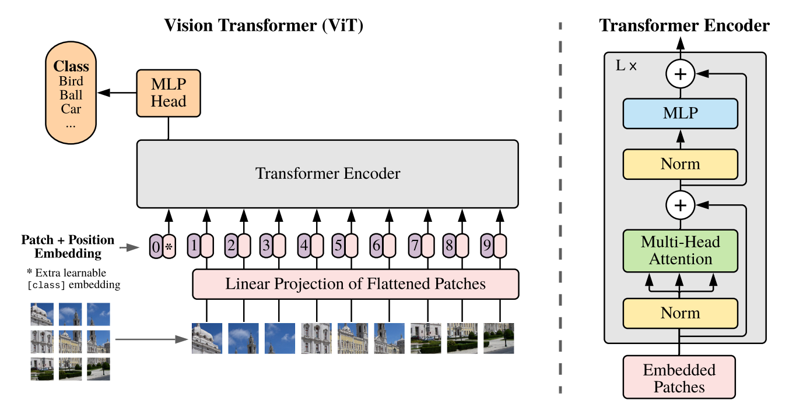
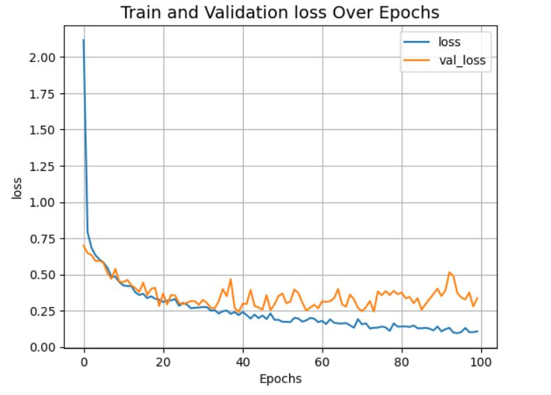

## AN IMAGE IS WORTH 16X16 WORDS: TRANSFORMERS FOR IMAGE RECOGNITION AT SCALE application Paper Implementation in Keras 3

## Br35H::Brain Tumor Detection 2020 Image Classification using Vision Transformer
The repository contains the code for the Brain Tumor Detection image classification using Vision Transformer in the Keras 3 

- Arxiv Paper: [AN IMAGE IS WORTH 16X16 WORDS:TRANSFORMERS FOR IMAGE RECOGNITION AT SCALE](https://arxiv.org/pdf/2010.11929.pdf)

## Architecture
|  |
| :--: |
| *The block diagram of the Vision Transformer along with the Transformer Encoder.* |

Read the ViT paper and Implemented the same in the Keras 3 with Tensorflow as a backend on the Br35H Dataset.

Let's break down the key components and functionalities of the code:

1. **Task 1: Importing the Libraries and defining the key components**
2. **Task 2: Preparation of the data**
3. **Task 3: Converting the Images into the Patches**
4. **Task 4: Perform the Linear Projection on the Patches**
5. **Task 5: Create a class token class i.e. learnable embeddings and prepend that to the Linear project of the Patches (or Patch embeddings)**
6. **Task 6: Create the position embeddings and add them to the (Patch embedding and learnable embeddings)**
7. **Task 7: Embedded patches then passed to the Transformer encoder**
8. **Task 8: Train a transformer model and calculate the testing accuracy**

## Results
- Trained on GPU P100
- Trained for epochs : 100
- Test accuracy : 92.33%%

<be>
 

|  | 
| :--: | :--: |
| *The Plot of the Vision Transformer Train and Validation Accuracy over Epochs.* | *The Plot of the Vision Transformer Train and Validation loss over Epochs.* |
